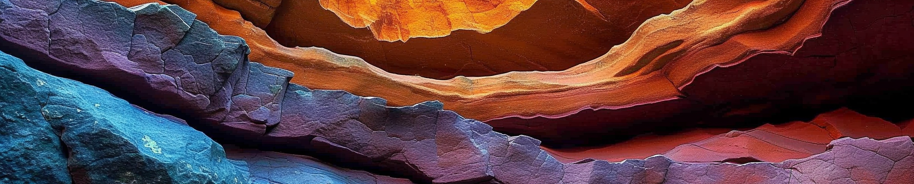

# 🌋 Every Layer, Everywhere, All at Once: Segmenting Subsurface



This project was made possible by our compute partners [2CRSI](https://2crsi.com/)
and [NVIDIA](https://www.nvidia.com/).

## 🏆 Challenge ranking

## 🛠️ Data processing

## 🏛️ Model architecture

## #️⃣ Command lines

### Launch a training

```bash
python src/models/<nom du model>/train_model.py <hyperparams args>
```
View project's runs on [WandB](https://wandb.ai/association-rosia/segmenting-subsurface/).

### Create a submission

```bash
python src/models/predict_model.py -n {model.ckpt}
```


## 🔬 References

Kirillov, A., Mintun, E., Ravi, N., Mao, H., Rolland, C., Gustafson, L., ... & Girshick, R. (2023). Segment anything. arXiv preprint arXiv:2304.02643.

Cheng, B., Misra, I., Schwing, A. G., Kirillov, A., & Girdhar, R. (2022). Masked-attention mask transformer for universal image segmentation. In Proceedings of the IEEE/CVF conference on computer vision and pattern recognition (pp. 1290-1299).

Xie, E., Wang, W., Yu, Z., Anandkumar, A., Alvarez, J. M., & Luo, P. (2021). SegFormer: Simple and efficient design for semantic segmentation with transformers. Advances in Neural Information Processing Systems, 34, 12077-12090.

## 📝 Citing

```
@misc{UrgellReberga:2023,
  Author = {Louis Reberga and Baptiste Urgell},
  Title = {Segmenting Subsurface},
  Year = {2024},
  Publisher = {GitHub},
  Journal = {GitHub repository},
  Howpublished = {\url{https://github.com/association-rosia/segmenting-subsurface}}
}
```

## 🛡️ License

Project is distributed under [MIT License](https://github.com/association-rosia/segmenting-subsurface/blob/main/LICENSE)


## 👨🏻‍💻 Contributors

Louis
REBERGA <a href="https://twitter.com/rbrgAlou"></a> <a href="https://www.linkedin.com/in/louisreberga/"></a> <a href="louis.reberga@gmail.com"></a>

Baptiste
URGELL <a href="https://twitter.com/Baptiste2108"></a> <a href="https://www.linkedin.com/in/baptiste-urgell/"></a> <a href="baptiste.u@gmail.com"></a> 