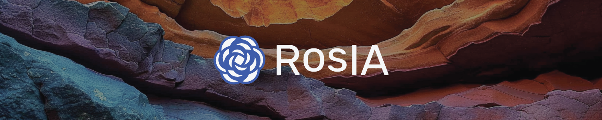
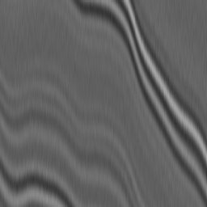
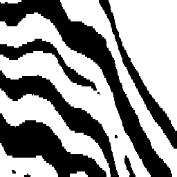
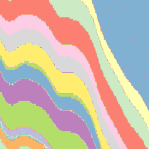
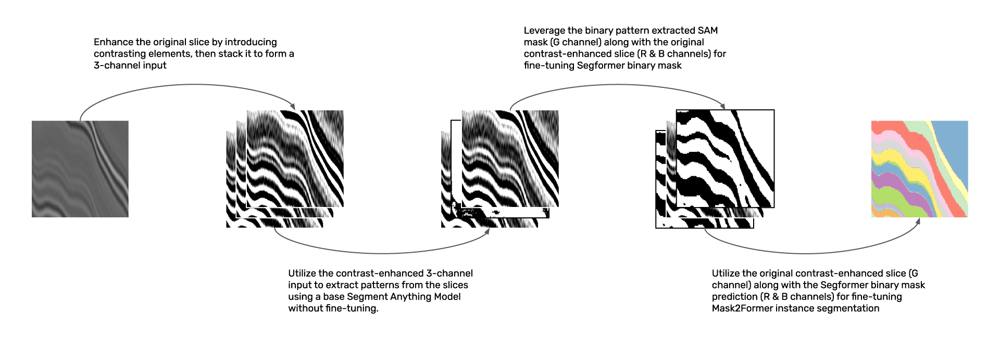

# 🌋 Every Layer, Everywhere, All at Once: Segmenting Subsurface



This project is part of a competition aiming to expand the capabilities of Meta's Segment Anything Model (SAM) to perform multi-layer segmentation in 3D seismic data. The challenge involves creating machine learning models that can identify and map multiple geological layers simultaneously, thereby streamlining the interpretation process of seismic datasets. With a large training set of around 9,000 labeled seismic volumes representing a wide range of geological conditions, the goal is to develop generalizable and efficient algorithms that can cope with the inherent complexities of seismic data. The models will be evaluated against a complex holdout dataset to ensure robust performance across diverse geological features. This repository documents the development and implementation of our solution to this advanced pattern recognition and data analysis challenge.

This project was made possible by our compute partners [2CRSI](https://2crsi.com/)
and [NVIDIA](https://www.nvidia.com/).

## 🏆 Challenge ranking
The score of the challenge was a custom DICE coefficient.  
Our solution was the best one (out of 225 teams) on the *Prediction Leaderboard* with a DICE coefficient equal to 0.65 🎉.

*Prediction Leaderboard* podium:  
🥇 RosIA - 0.65  
🥈 Kyle Peters - 0.64  
🥉 Jie Tian - 0.62  

Our solution was the ... (out of the 10 best teams) on the *Final Leaderboard* with a DICE coefficient equal to ... 🎉.

*Final Leaderboard* podium:  
🥇  
🥈  
🥉  

## 🖼️ Result example

Raw seismic slice | Predicted binary mask | Predicted layers
:--------------------:|:--------------------:|:--------------------:|
 |  | 

## 🏛️ Proposed solution



## #️⃣ Command lines

### Launch a training

```bash
python src/models/<nom du model>/train_model.py <hyperparams args>
```

View project's runs on [WandB](https://wandb.ai/association-rosia/segmenting-subsurface/).

### Create a submission

```bash
python src/models/predict_model.py -n {model.ckpt}
```

## 🔬 References

Kirillov, A., Mintun, E., Ravi, N., Mao, H., Rolland, C., Gustafson, L., ... & Girshick, R. (2023). Segment anything.
arXiv preprint arXiv:2304.02643.

Cheng, B., Misra, I., Schwing, A. G., Kirillov, A., & Girdhar, R. (2022). Masked-attention mask transformer for
universal image segmentation. In Proceedings of the IEEE/CVF conference on computer vision and pattern recognition (pp.
1290-1299).

Xie, E., Wang, W., Yu, Z., Anandkumar, A., Alvarez, J. M., & Luo, P. (2021). SegFormer: Simple and efficient design for
semantic segmentation with transformers. Advances in Neural Information Processing Systems, 34, 12077-12090.

## 📝 Citing

```
@misc{RebergaUrgell:2024,
  Author = {Louis Reberga and Baptiste Urgell},
  Title = {Segmenting Subsurface},
  Year = {2024},
  Publisher = {GitHub},
  Journal = {GitHub repository},
  Howpublished = {\url{https://github.com/association-rosia/segmenting-subsurface}}
}
```

## 🛡️ License

Project is distributed under [MIT License](https://github.com/association-rosia/segmenting-subsurface/blob/main/LICENSE)

## 👨🏻‍💻 Contributors

Louis
REBERGA <a href="https://twitter.com/rbrgAlou"></a> <a href="https://www.linkedin.com/in/louisreberga/"></a> <a href="louis.reberga@gmail.com"></a>

Baptiste
URGELL <a href="https://twitter.com/Baptiste2108"></a> <a href="https://www.linkedin.com/in/baptiste-urgell/"></a> <a href="baptiste.u@gmail.com"></a> 
